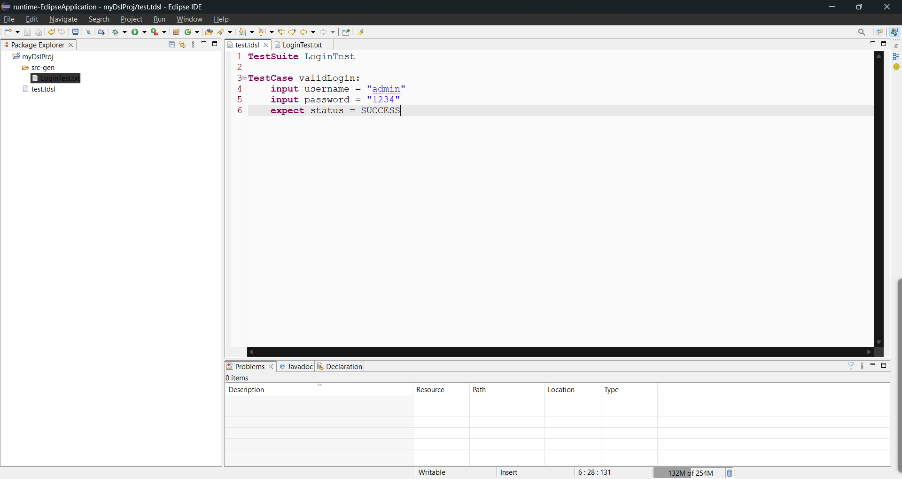
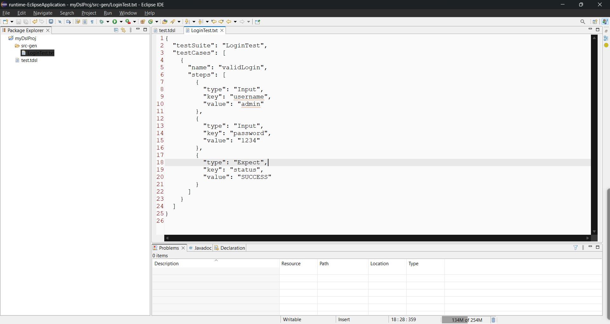

# TestDSL 🚀

A Domain Specific Language (DSL) built using Xtext to define and generate structured test cases.

---

## ✨ Features

* Define Test Suites and Test Cases
* Add Inputs and Expected Outputs
* Generate structured JSON
* Clean and readable DSL syntax

---

## 🧩 Example DSL

```dsl
TestSuite LoginTest

TestCase validLogin:
    input username = "admin"
    input password = "1234"
    expect status = SUCCESS
```

---

## 📤 Generated Output

```json
{
  "testSuite": "LoginTest",
  "testCases": [
    {
      "name": "validLogin",
      "steps": [
        {
          "type": "Input",
          "key": "username",
          "value": "admin"
        },
        {
          "type": "Input",
          "key": "password",
          "value": "1234"
        },
        {
          "type": "Expect",
          "key": "status",
          "value": "SUCCESS"
        }
      ]
    }
  ]
}
```

---

## 🖼️ Screenshots

### DSL Example



### Generated Output



---

## 🛠️ Tech Stack

* Xtext
* Eclipse Modeling Framework (EMF)
* Xtend
* Java

---

## 🚀 How to Run

1. Import project into Eclipse
2. Run as **Eclipse Application**
3. Create a `.testdsl` file
4. Right-click → **Generate**

---

## 📌 Use Cases

* Test automation frameworks
* Config-driven testing
* DSL-based QA pipelines

---

## 🔮 Future Improvements

* Validation (error checking)
* CLI runner
* Java test generation
* IDE enhancements (highlighting, autocomplete)

---

## 👨‍💻 Author

Tuhin Mohanty